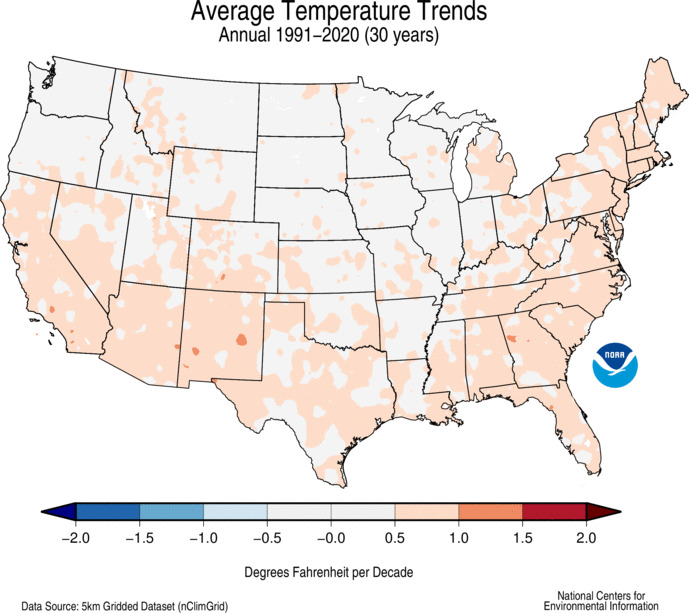

```{r, include = FALSE}
knitr::opts_chunk$set(
  dpi = 200, 
  fig.height = 5, 
  fig.width = 8,
  # out.height = 400, 
  collapse = TRUE,
  comment = "#>"
)
```

```{r setup}
library(rustcrn)
```

1. Make a map of the average temperature at each station for the month of March 2024.
```{r}
# get dataset of march 2024 data from each station
march_2024 <- subset(full_daily_weather, 
                     full_daily_weather$LST_DATE >= as.Date("2024-03-01") &
                     full_daily_weather$LST_DATE <= as.Date("2024-03-31"))


# calculate the mean average temperature from each station

average_march <- tapply(march_2024$T_DAILY_AVG, 
               march_2024$WBANNO, function(x) {mean(x, na.rm = T)} )

dat <- stations[match(as.numeric(names(average_march)), stations$WBANNO),] 
dat$mar_temp <- average_march

dat <- na.omit(dat)
# head(dat, 10)

## Plotting map
# Plot USA polygons using ggplot2 map_data
usa <- ggplot2::map_data("state")

# create plotting window to surround USA polygon 
par(bg = "grey90") 
par(mar = c(1,2,4.1,2))

plot(NA, NA, xlim = c(min(usa$long), max(usa$long)), 
     ylim = c(min(usa$lat), max(usa$lat)), asp = 1.3, 
     axes = F, xlab = "", ylab = "", 
     main = "Average Temperature of Stations on March 2024")

# plot polygons by group with tapply 
invisible(tapply(usa, usa$group, function(x) polygon(x$long, x$lat,
                                   lwd = 0.5, border = "grey30", col = "white")))

# plot data points with color based on march temp
points(dat$LONGITUDE, dat$LATITUDE, pch = 19, 
       col= heat.colors(length(dat$mar_temp), rev = TRUE)[rank(dat$mar_temp)], 
       cex = 0.5)


#legend created
lgd <- rep(NA, 11)
lgd[c(1, 6,11)] = c( round(min(dat$mar_temp), 3),  
                     round(median(dat$mar_temp), 3), 
                     round(max(dat$mar_temp), 3) )

# Create legend with dynamic color representation
legend(-75, 35, legend = lgd, 
       fill =  heat.colors(11, rev = TRUE), 
       border = NA, y.intersp = 0.5, cex = 0.5, box.lwd = 0,
       title = "Temperature (°C)\n", 
       xjust = 0)

#legend
```


2. Fit a spatial model and plot an interpolated map of average temperatures for March 2024. Consider including elevation in your model.
```{r}
# Convert station coordinates to an sf object, with crs for the contiguous 48 
dat_sf <- sf::st_as_sf(x = dat, coords = c("LONGITUDE", "LATITUDE"), 
                       crs = 4326, remove = TRUE)

# Use elevatr to get elevations for stations
elev <- elevatr::get_elev_point(dat_sf, src = "aws")
dat$elevation <- elev$elevation

# Use elevatr to get elevations for prediction grid 
grid_sf <- sf::st_as_sf(x = grid_points_usa(), coords = c("long", "lat"), 
                        crs = 4326)
elev.pred <- elevatr::get_elev_point(grid_sf, src = "aws")
elev.mat <- cbind(1, elev.pred$elevation)

# Create interpolation including elevation as covariate
mar_inter <- interpolation(mar_temp ~ LONGITUDE + LATITUDE + elevation, 
                           X_pred = elev.mat, 
                           data = dat)

# Draw interpolated plot 
plotting_interpolation(mar_inter, 
                       main = "Estimated average temperatures in March 2024", 
                       palette = "Temps")
```


3. Estimate the warmest and coldest day of the year for each station, and plot those days on two maps. Think carefully about how to represent the days numerically.
```{r}
station_id <- stations$WBANNO
st <- stations

# Initializing columns for data to be stored
st$min_doy <- NA
st$max_doy <- NA
st$min_temp <- NA
st$max_temp <- NA

# Loop through each station ID and calculate min and max temperatures and their dates
for (i in 1:length(station_id)) {
    year_data <- yearly_cycle(station_id[i])
    min_index <- which.min(year_data$t_daily_pred)
    max_index <- which.max(year_data$t_daily_pred)

    st$min_temp[i] <- year_data$t_daily_pred[min_index]
    st$max_temp[i] <- year_data$t_daily_pred[max_index]
    st$min_doy[i] <- year_data$doy[min_index]
    st$max_doy[i] <- year_data$doy[max_index]
}
# head((st), 10)


## Warmest
# Draw plotting window and US states
par(bg = "grey90")
par(mar = c(1,2,4.1,2))
plot(NA, NA, xlim = c(min(usa$long), max(usa$long)), 
     ylim = c(min(usa$lat), max(usa$lat)), asp = 1.3, 
     axes = F, xlab = "", ylab = "", 
     main = "Estimated coldest day of the year since January 1 \nat USCRN weather stations")

invisible(tapply(usa, usa$group, function(x) polygon(x$long, x$lat,
                                   lwd = 0.5, border = "grey30", col = "white")))

# Write in day of year 
text(st$LONGITUDE, st$LATITUDE, st$max_doy, cex= 0.5)

## Coldest
# Draw plotting window and US states
par(bg = "grey90")
par(mar = c(1,2,4.1,2))
plot(NA, NA, xlim = c(min(usa$long), max(usa$long)), 
     ylim = c(min(usa$lat), max(usa$lat)), asp = 1.3, 
     axes = F, xlab = "", ylab = "", 
     main = "Estimated coldest day of the year \nat USCRN weather stations")

invisible(tapply(usa, usa$group, function(x) polygon(x$long, x$lat,
                                   lwd = 0.5, border = "grey30", col = "white")))

# Write in day of year 
text(st$LONGITUDE, st$LATITUDE, st$min_doy, cex= 0.3)

```

The warmest and coldest days of the year are based on a linear model predicting 
the yearly cycle of a certain weather station by 
modeling the first and second harmonic of a periodic sine/cosine cycle based on 
day of year, assuming independent, normal error with a constant variance and a 
second harmonic sinusoidal relationship between the predictor (day of year) and 
the outcome (temperature). 

Let $T=$ average temperature as recorded in T_DAILY_AVG in °C; 
$d =$ day of the year (1-366); 
$P = 365.25$, the constant period of a yearly cycle; 
$\epsilon =$ the residual error $\sim N(0, \sigma^2)$; 
$\beta_{0}$ coefficients of the constant term; 
$\beta_{1...4}$ coefficients of the predictor terms. 

$$
T = \beta_0 + \beta_1\text{cos}(2\pi\frac{d}{P}) 
+ \beta_2\text{sin}(2\pi\frac{d}{P}) + \beta_3\text{cos}(4\pi\frac{d}{P}) 
+ \beta_4\text{sin}(4\pi\frac{d}{P}) + \epsilon
$$


4. Make a single plot of the estimated yearly cycles for 10 different
stations, highlighting a diversity of climates around the contiguous USA.
Your plot should clearly indicate which cycle is from which station.

```{r}
# Stations: Asheville, NC (53878); Ithaca, NY (64758); Boulder, CO (94075);
 #          Des Moines, ID (54902); Moose, WY (4131); Santa Barbara, CA (53152);
 #          Sioux Falls, SD (4990); Ajo, AZ (53168); Titusville, FL (92821);
 #          Austin, TX (23907)

selected <- c(53878, 64758, 94075, 54902, 4131, 53152, 4990, 53168, 92821, 23907)
cycles <- list()

# get yearly cycles for each station 
for(i in 1:10) {
  cycles[[i]] <- yearly_cycle(selected[i])
}

# draw axes  
plot(NULL, NULL, xlim = c(1,365), ylim = c(-25,35), axes = FALSE,
     ylab = "Estimated temperature (°C)", xlab = "")
axis.Date(1, format = "%B")
axis(2)
title(main = "USCRN weather station yearly cycles")

# plot cycles as lines 
for(i in 1:10) {
  lines(cycles[[i]][,1], cycles[[i]][,2], col = i, lty = i)
}

# draw legend under cycles
legend(160, 3, legend = c("Asheville, NC", "Ithaca, NY", "Boulder, CO",
                         "Des Moines, ID", "Moose, WY", "Santa Barbara, CA",
                         "Sioux Falls, SD", "Ajo, AZ", "Titusville, FL",
                         "Austin, TX"),
       col = 1:10, lty = 1:10, cex = 0.5)
```


4. Estimate the trend over the years for each station, in units of degrees Fahrenheit per year, and plot the trend values on a map. Indicate visually on your map which of the trends are statistically significant.

```{r}
# Get the yearly trend for all stations 
trends <- as.data.frame( cbind( WBANNO = stations$WBANNO,
                        matrix(nrow = nrow(stations),
                               ncol = 4,
                               dimnames = list(NULL, c("trend", "p", "se", "len"))),
                        LONGITUDE = stations$LONGITUDE,
                        LATITUDE = stations$LATITUDE ) )

for(i in 1:nrow(trends)) {
  trends[i,1:5] <- temp_trend(trends[i,1])
}

# Determine trend significance 
sig <- rep(FALSE, times = nrow(trends))
sig[trends$p < 0.001] <- TRUE
trends$sig <- sig

# Color in the points depending on magnitude and direction of trend
trends$color <- lapply(trends$trend, function(x) {
  if(x < 0) rgb(0, 0, abs(x)/(abs(x) + 0.02))
  else rgb(x/(x + 0.1), 0, 0)
})

# Remove points in Hawaii, Alaska, and the Sakha Republic 
hi_ak_sa <- which(stations$state %in% c("HI", "AK", "SA"))
plot_trends <- trends[-hi_ak_sa,]

# Create plotting window and map of the USA
usa <- ggplot2::map_data("state")

par(bg = "grey90")
par(mar = c(1,2,4.1,2))

plot(NA, NA, xlim = c(min(usa$long), max(usa$long)), 
     ylim = c(min(usa$lat), max(usa$lat)), asp = 1.3, 
     axes = F, xlab = "", ylab = "", 
     main = "Temperature trends at USCRN weather stations \nin the contiguous 48")

invisible(tapply(usa, usa$group, function(x) polygon(x$long, x$lat,
                                   lwd = 0.5, border = "grey30", col = "white")))

# Draw significance indicators 
points(plot_trends$LONGITUDE[sig], plot_trends$LATITUDE[sig], 
       col = "orange", pch = 8, cex = 0.6)

# Draw trend points 
points(plot_trends$LONGITUDE, plot_trends$LATITUDE,
     col = as.character(plot_trends$color), pch = 16,  cex = 0.5)

# Create legend for point color and temperature 
lgd <- rep(NA, 11)
lgd[c(1,6,11)] = c(1,0,-1)
legend(-75, 35, legend = lgd, 
       fill = colorRampPalette(colors = c('red','black','blue'))(11),
       border = NA, y.intersp = 0.5, cex = 0.5, box.lwd = 0,
       title = "°C/year \n", 
       xjust = 0)

# Create legend for significance
legend(-120, 31, 
       legend = c("p < 0.001"), col = "orange", pch = 8, 
       title = "Significance", 
       horiz = F, cex = 0.6, box.lwd = 0)
```


A linear model including terms for the first and second harmonic of a periodic
sine/cosine cycle as covariates for the year since 2000, assuming independent, 
normal error with a constant variance and a second harmonic relationship 
between the predictor (day) and the outcome (temperature). 

Let $T=$ average temperature as recorded in T_DAILY_AVG in °C; 
$y =$ a continuous variable representing days since January 1, 2000; 
$d =$ day of the year (1-366); 
$P = 365.25$, the constant period of a yearly cycle; 
$\epsilon =$ the residual error $\sim N(0, \sigma^2)$; 
$\beta_0$ coefficient of the constant term (intercept); 
$\beta_1$ coefficient of the predictor (year); 
$\beta_{2...5}$ coefficients of the covariates. 

$$
T = \beta_0 + \beta_1y + \beta_2\text{cos}(2\pi\frac{d}{P}) 
+ \beta_3\text{sin}(2\pi\frac{d}{P}) + \beta_4\text{cos}(4\pi\frac{d}{P}) 
+ \beta_4\text{sin}(4\pi\frac{d}{P}) + \epsilon
$$

The coefficient $\beta_1$ represents the temperature trend across the collection 
period in °C/year. 


Interpolate the estimated trends to a grid, and plot them on a map. For the 
interpolations, you may consider using only the trend estimates whose standard 
errors are sufficiently small.

```{r}
# Remove station trends with a very high standard error or a very low 
# collection time 
high_se <- which(trends$se > 5)
low_len <- which(trends$len < 5)

inter_trends <- trends[-c(high_se, low_len, hi_ak_sa),]

# Create interpolation
i_t <- interpolation(trend ~ LONGITUDE + LATITUDE, 
                     data = inter_trends)

# Plot interpolation
plotting_interpolation(i_t, 
                       main = paste0("Estimated temperature trend in °C/year", 
                                     " across the \nUS contiguous 48"), 
                       palette = "Temps")
```


5. Find a reputable source for the average temperature trend in the contiguous USA 
over the past 20 years, and compare your results to the source’s.

Compared to the NOAA trend estimates based on the past 30 years, our temperature 
trend predicts overall slightly higher increases in temperature (except for Florida, 
which has much greater increase, and the Southwest, which has lower magnitude
increase), but in general agrees that the southern and coastal US has greater 
temperature trends than the central US. 



